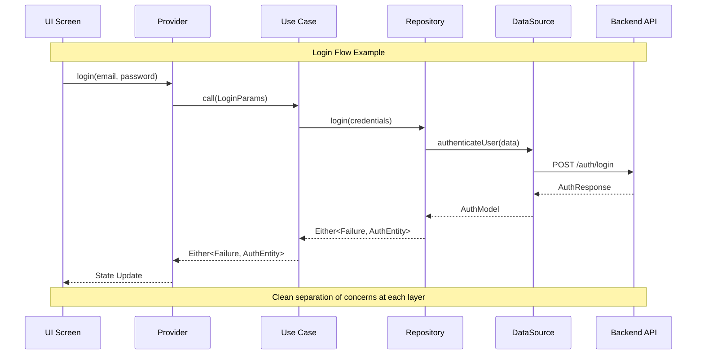
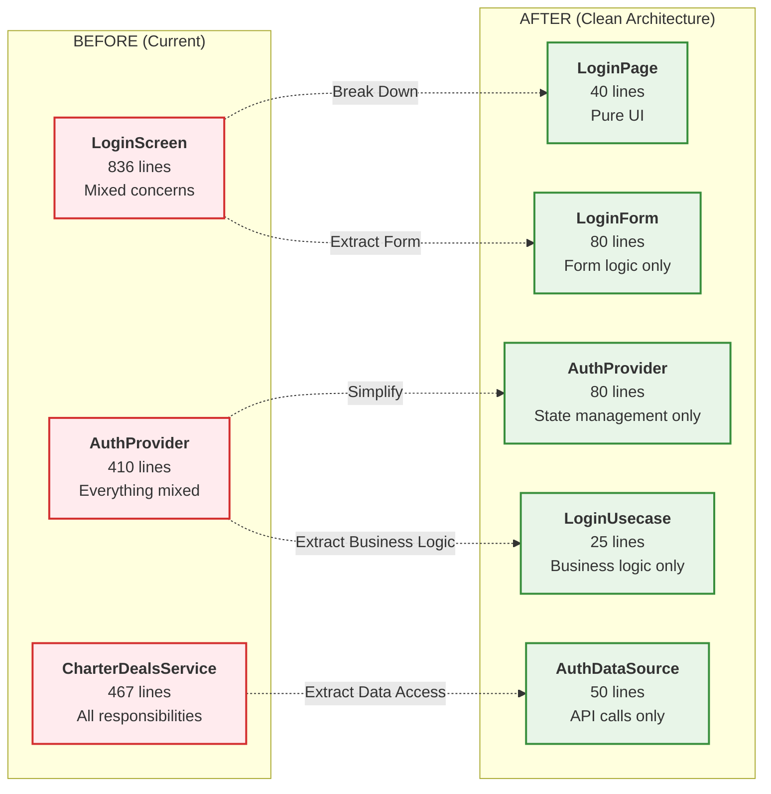
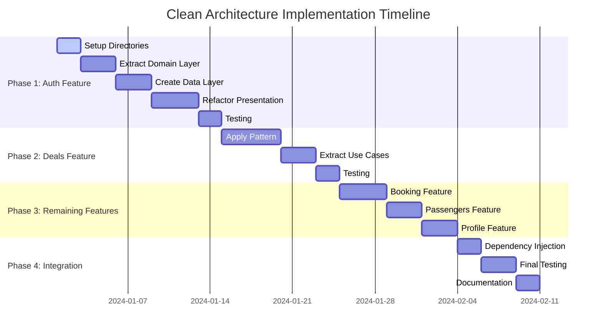

# Flutter Air Charters - Clean Architecture Transformation

## Current vs Proposed Architecture Diagram

```mermaid
graph TB
    subgraph "CURRENT ARCHITECTURE (Issues)"
        subgraph "Current Presentation"
            CUR_UI["`**Current UI Screens**
            • LoginScreen (836 lines!)
            • BookingDetail (739 lines!)
            • ReviewTrip (1292 lines!)
            • Mixed responsibilities`"]
        end
        
        subgraph "Current State Management"
            CUR_AUTH["`**AuthProvider (410 lines)**
            • Authentication
            • Token Management
            • Profile Data
            • Error Handling
            • Validation`"]
            
            CUR_DEALS["`**CharterDealsProvider**
            • Flight Search
            • Deal Management
            • Filtering
            • State Management`"]
        end
        
        subgraph "Current Business Logic"
            CUR_REPO["`**AuthRepository (301 lines)**
            • API Calls
            • Business Logic
            • Storage
            • Error Handling
            • Validation`"]
            
            CUR_SERVICE["`**CharterDealsService (467 lines)**
            • API Calls
            • Caching
            • Business Logic
            • Data Transformation`"]
        end
    end
    
    subgraph "PROPOSED CLEAN ARCHITECTURE"
        subgraph "Auth Feature"
            subgraph "Auth Presentation"
                AUTH_UI["`**Auth Pages (40 lines each)**
                • LoginPage
                • SignupPage
                • VerifyCodePage`"]
                
                AUTH_WIDGETS["`**Auth Widgets (50 lines each)**
                • LoginForm
                • CredentialInput
                • AuthButton`"]
                
                AUTH_PROV["`**AuthProvider (80 lines)**
                • Pure state management
                • Calls use cases only`"]
            end
            
            subgraph "Auth Domain"
                AUTH_ENTITIES["`**Entities (15 lines each)**
                • AuthEntity
                • UserEntity`"]
                
                AUTH_REPO_INT["`**Repository Interface**
                • AuthRepository
                • Abstract contracts`"]
                
                AUTH_USECASES["`**Use Cases (25 lines each)**
                • LoginUsecase
                • SignupUsecase
                • LogoutUsecase
                • RefreshTokenUsecase`"]
            end
            
            subgraph "Auth Data"
                AUTH_MODELS["`**Models (40 lines each)**
                • AuthModel
                • UserModel
                • DTOs`"]
                
                AUTH_DATASOURCES["`**DataSources (50 lines each)**
                • AuthRemoteDataSource
                • AuthLocalDataSource`"]
                
                AUTH_REPO_IMPL["`**Repository Impl (60 lines)**
                • AuthRepositoryImpl
                • Coordinates datasources`"]
            end
        end
        
        subgraph "Deals Feature"
            subgraph "Deals Presentation"
                DEALS_UI["`**Deal Pages**
                • SearchPage
                • DealsListPage
                • DealDetailPage`"]
                
                DEALS_WIDGETS["`**Deal Widgets**
                • DealCard
                • SearchFilter
                • DealsList`"]
                
                DEALS_PROV["`**DealsProvider**
                • Pure state management
                • Calls use cases only`"]
            end
            
            subgraph "Deals Domain"
                DEALS_ENTITIES["`**Entities**
                • DealEntity
                • SearchEntity
                • FilterEntity`"]
                
                DEALS_REPO_INT["`**Repository Interface**
                • DealsRepository`"]
                
                DEALS_USECASES["`**Use Cases**
                • FetchDealsUsecase
                • SearchDealsUsecase
                • FilterDealsUsecase`"]
            end
            
            subgraph "Deals Data"
                DEALS_MODELS["`**Models**
                • DealModel
                • SearchModel`"]
                
                DEALS_DATASOURCES["`**DataSources**
                • DealsRemoteDataSource
                • DealsLocalDataSource`"]
                
                DEALS_REPO_IMPL["`**Repository Impl**
                • DealsRepositoryImpl`"]
            end
        end
        
        subgraph "Booking Feature"
            subgraph "Booking Presentation"
                BOOKING_UI["`**Booking Pages**
                • BookingPage
                • ReviewPage
                • PaymentPage`"]
                
                BOOKING_PROV["`**BookingProvider**
                • Booking state only`"]
            end
            
            subgraph "Booking Domain"
                BOOKING_ENTITIES["`**Entities**
                • BookingEntity
                • PassengerEntity`"]
                
                BOOKING_USECASES["`**Use Cases**
                • CreateBookingUsecase
                • ReviewBookingUsecase
                • ProcessPaymentUsecase`"]
            end
            
            subgraph "Booking Data"
                BOOKING_DATASOURCES["`**DataSources**
                • BookingRemoteDataSource
                • BookingLocalDataSource`"]
            end
        end
        
        subgraph "Shared Core"
            CORE_ERROR["`**Error Handling**
            • Failures
            • Exceptions`"]
            
            CORE_NETWORK["`**Network**
            • ApiClient
            • Interceptors`"]
            
            CORE_UTILS["`**Utilities**
            • Either
            • Validators`"]
        end
    end
    
    subgraph "BACKEND (No Changes Needed)"
        BACKEND["`**NestJS Backend**
        ✅ Already Clean Architecture
        • Controllers
        • Services  
        • Repositories
        • Entities`"]
    end
    
    %% Current Architecture Issues
    CUR_UI -.->|"Mixed Responsibilities"| CUR_AUTH
    CUR_AUTH -.->|"Large Files"| CUR_REPO
    CUR_REPO -.->|"Tight Coupling"| BACKEND
    
    %% Clean Architecture Flow - Auth
    AUTH_UI --> AUTH_PROV
    AUTH_PROV --> AUTH_USECASES
    AUTH_USECASES --> AUTH_REPO_INT
    AUTH_REPO_INT --> AUTH_REPO_IMPL
    AUTH_REPO_IMPL --> AUTH_DATASOURCES
    AUTH_DATASOURCES --> BACKEND
    
    %% Clean Architecture Flow - Deals
    DEALS_UI --> DEALS_PROV
    DEALS_PROV --> DEALS_USECASES
    DEALS_USECASES --> DEALS_REPO_INT
    DEALS_REPO_INT --> DEALS_REPO_IMPL
    DEALS_REPO_IMPL --> DEALS_DATASOURCES
    DEALS_DATASOURCES --> BACKEND
    
    %% Clean Architecture Flow - Booking
    BOOKING_UI --> BOOKING_PROV
    BOOKING_PROV --> BOOKING_USECASES
    BOOKING_USECASES --> BOOKING_DATASOURCES
    BOOKING_DATASOURCES --> BACKEND
    
    %% Shared Dependencies
    AUTH_REPO_IMPL --> CORE_ERROR
    AUTH_REPO_IMPL --> CORE_NETWORK
    DEALS_REPO_IMPL --> CORE_ERROR
    DEALS_REPO_IMPL --> CORE_NETWORK
    
    %% Domain Dependencies
    AUTH_USECASES --> AUTH_ENTITIES
    DEALS_USECASES --> DEALS_ENTITIES
    BOOKING_USECASES --> BOOKING_ENTITIES
    
    %% Data Dependencies
    AUTH_REPO_IMPL --> AUTH_MODELS
    DEALS_REPO_IMPL --> DEALS_MODELS
    AUTH_MODELS --> AUTH_ENTITIES
    DEALS_MODELS --> DEALS_ENTITIES
    
    %% Styling
    classDef currentIssue fill:#FFEBEE,stroke:#D32F2F,stroke-width:3px
    classDef presentation fill:#E3F2FD,stroke:#1976D2,stroke-width:2px
    classDef domain fill:#E8F5E8,stroke:#388E3C,stroke-width:2px
    classDef data fill:#FFF3E0,stroke:#F57C00,stroke-width:2px
    classDef backend fill:#F3E5F5,stroke:#7B1FA2,stroke-width:2px
    classDef core fill:#FAFAFA,stroke:#424242,stroke-width:2px
    
    class CUR_UI,CUR_AUTH,CUR_REPO,CUR_SERVICE currentIssue
    class AUTH_UI,AUTH_WIDGETS,AUTH_PROV,DEALS_UI,DEALS_WIDGETS,DEALS_PROV,BOOKING_UI,BOOKING_PROV presentation
    class AUTH_ENTITIES,AUTH_REPO_INT,AUTH_USECASES,DEALS_ENTITIES,DEALS_REPO_INT,DEALS_USECASES,BOOKING_ENTITIES,BOOKING_USECASES domain
    class AUTH_MODELS,AUTH_DATASOURCES,AUTH_REPO_IMPL,DEALS_MODELS,DEALS_DATASOURCES,DEALS_REPO_IMPL,BOOKING_DATASOURCES data
    class BACKEND backend
    class CORE_ERROR,CORE_NETWORK,CORE_UTILS core
```

## Data Flow in Clean Architecture

## File Size Transformation

## Implementation Roadmap

