# Payment API Integration Architecture Analysis

## 🎯 **Recommendation: Backend Integration (NestJS Server)**

**TL;DR:** Integrate payment APIs in your **NestJS backend server**, not the Flutter app. Here's why and how:

## 📊 **Comparison: Backend vs Frontend Integration**

```mermaid
graph TB
    subgraph "❌ FRONTEND INTEGRATION (Not Recommended)"
        subgraph "Flutter App"
            FLUTTER_UI["`**Flutter UI**
            • Payment Forms
            • Card Input
            • Payment Processing`"]
            
            FLUTTER_PAYMENT["`**Payment SDK**
            • Stripe Flutter SDK
            • PayPal SDK
            • Direct API Calls`"]
            
            FLUTTER_STATE["`**State Management**
            • Payment Status
            • Transaction Data
            • Error Handling`"]
        end
        
        subgraph "External Payment APIs"
            STRIPE_API["`**Stripe API**
            • Process Payments
            • Handle Cards
            • Webhooks`"]
            
            PAYPAL_API["`**PayPal API**
            • Process Payments
            • Handle Wallets`"]
        end
        
        subgraph "Backend (Limited Role)"
            BACKEND_LIMITED["`**NestJS Backend**
            • Receive payment confirmation
            • Update booking status
            • Generate receipts`"]
        end
    end
    
    subgraph "✅ BACKEND INTEGRATION (Recommended)"
        subgraph "Flutter App (Secure)"
            FLUTTER_UI_SECURE["`**Flutter UI**
            • Payment Forms (UI only)
            • Card Input (tokenized)
            • Loading States`"]
            
            FLUTTER_SECURE["`**Secure Payment Flow**
            • Collect payment details
            • Send to backend
            • Display results`"]
        end
        
        subgraph "NestJS Backend (Secure)"
            PAYMENT_CONTROLLER["`**PaymentController**
            • /api/payments/process
            • /api/payments/webhook
            • /api/payments/refund`"]
            
            PAYMENT_SERVICE["`**PaymentService**
            • Payment processing logic
            • Webhook handling
            • Refund processing`"]
            
            PAYMENT_PROVIDERS["`**Payment Providers**
            • StripeProvider
            • PayPalProvider
            • MobileMoneyProvider`"]
            
            PAYMENT_DB["`**Payment Database**
            • Transaction records
            • Payment status
            • Audit trails`"]
        end
        
        subgraph "External APIs (Secure)"
            STRIPE_SECURE["`**Stripe API**
            • Server-to-server
            • Webhook notifications
            • Secure processing`"]
            
            PAYPAL_SECURE["`**PayPal API**
            • Server-to-server
            • Webhook notifications`"]
        end
    end
    
    %% Frontend Integration Flow (Problematic)
    FLUTTER_UI --> FLUTTER_PAYMENT
    FLUTTER_PAYMENT --> STRIPE_API
    FLUTTER_PAYMENT --> PAYPAL_API
    STRIPE_API -.-> BACKEND_LIMITED
    PAYPAL_API -.-> BACKEND_LIMITED
    
    %% Backend Integration Flow (Secure)
    FLUTTER_UI_SECURE --> FLUTTER_SECURE
    FLUTTER_SECURE --> PAYMENT_CONTROLLER
    PAYMENT_CONTROLLER --> PAYMENT_SERVICE
    PAYMENT_SERVICE --> PAYMENT_PROVIDERS
    PAYMENT_PROVIDERS --> STRIPE_SECURE
    PAYMENT_PROVIDERS --> PAYPAL_SECURE
    PAYMENT_SERVICE --> PAYMENT_DB
    STRIPE_SECURE -.->|"Webhooks"| PAYMENT_CONTROLLER
    PAYPAL_SECURE -.->|"Webhooks"| PAYMENT_CONTROLLER
    
    %% Styling
    classDef frontend fill:#FFEBEE,stroke:#D32F2F,stroke-width:3px
    classDef backend fill:#E8F5E8,stroke:#388E3C,stroke-width:3px
    classDef external fill:#E3F2FD,stroke:#1976D2,stroke-width:2px
    
    class FLUTTER_UI,FLUTTER_PAYMENT,FLUTTER_STATE,BACKEND_LIMITED frontend
    class FLUTTER_UI_SECURE,FLUTTER_SECURE,PAYMENT_CONTROLLER,PAYMENT_SERVICE,PAYMENT_PROVIDERS,PAYMENT_DB backend
    class STRIPE_API,PAYPAL_API,STRIPE_SECURE,PAYPAL_SECURE external
```



## 🔒 **Security Comparison**

| Aspect | Frontend Integration | Backend Integration |
|--------|---------------------|-------------------|
| **API Keys** | ❌ Exposed in app | ✅ Secure on server |
| **PCI DSS Compliance** | ❌ Complex/expensive | ✅ Easier to maintain |
| **Payment Secrets** | ❌ Vulnerable | ✅ Protected |
| **Transaction Logs** | ❌ Limited visibility | ✅ Complete audit trail |
| **Refund Processing** | ❌ Requires app update | ✅ Server-side control |
| **Webhook Handling** | ❌ Not possible | ✅ Real-time updates |

## 🏗️ **Recommended Backend Architecture**

```mermaid
graph TB
    subgraph "Flutter App"
        PAYMENT_UI["`**Payment Screens**
        • BookingPaymentPage
        • PaymentMethodPage
        • PaymentConfirmationPage`"]
        
        PAYMENT_PROV["`**PaymentProvider**
        • Payment state
        • API communication
        • Error handling`"]
    end
    
    subgraph "NestJS Backend"
        subgraph "Payment Module"
            PAY_CTRL["`**PaymentController**
            @Post('/process')
            @Post('/webhook')
            @Get('/status/:id')`"]
            
            PAY_SVC["`**PaymentService**
            • processPayment()
            • handleWebhook()
            • refundPayment()`"]
            
            PAY_GATEWAY["`**PaymentGateway Interface**
            • Abstraction for providers`"]
        end
        
        subgraph "Payment Providers"
            STRIPE_PROV["`**StripeProvider**
            • Implements PaymentGateway
            • Stripe-specific logic`"]
            
            PAYPAL_PROV["`**PayPalProvider**
            • Implements PaymentGateway
            • PayPal-specific logic`"]
            
            MPESA_PROV["`**MpesaProvider**
            • Mobile money
            • Africa-specific`"]
        end
        
        subgraph "Database"
            PAY_ENTITY["`**Payment Entity**
            • id, amount, status
            • booking_id, user_id
            • payment_method`"]
            
            TXN_ENTITY["`**Transaction Entity**
            • transaction_id
            • gateway_reference
            • created_at, updated_at`"]
        end
        
        subgraph "External Services"
            EMAIL_SVC["`**Email Service**
            • Payment confirmations
            • Receipt generation`"]
            
            SMS_SVC["`**SMS Service**
            • Payment notifications
            • Status updates`"]
        end
    end
    
    subgraph "External Payment APIs"
        STRIPE["`**Stripe API**
        • Credit/Debit cards
        • Bank transfers
        • Webhooks`"]
        
        PAYPAL["`**PayPal API**
        • PayPal wallet
        • Credit cards
        • Express checkout`"]
        
        MPESA["`**M-Pesa API**
        • Mobile money
        • STK Push
        • Callback URLs`"]
    end
    
    %% Connections
    PAYMENT_UI --> PAYMENT_PROV
    PAYMENT_PROV --> PAY_CTRL
    PAY_CTRL --> PAY_SVC
    PAY_SVC --> PAY_GATEWAY
    PAY_GATEWAY --> STRIPE_PROV
    PAY_GATEWAY --> PAYPAL_PROV
    PAY_GATEWAY --> MPESA_PROV
    
    STRIPE_PROV --> STRIPE
    PAYPAL_PROV --> PAYPAL
    MPESA_PROV --> MPESA
    
    PAY_SVC --> PAY_ENTITY
    PAY_SVC --> TXN_ENTITY
    PAY_SVC --> EMAIL_SVC
    PAY_SVC --> SMS_SVC
    
    %% Webhook flows
    STRIPE -.->|"Webhooks"| PAY_CTRL
    PAYPAL -.->|"Webhooks"| PAY_CTRL
    MPESA -.->|"Callbacks"| PAY_CTRL
    
    %% Styling
    classDef flutter fill:#E3F2FD,stroke:#1976D2,stroke-width:2px
    classDef backend fill:#E8F5E8,stroke:#388E3C,stroke-width:2px
    classDef external fill:#FFF3E0,stroke:#F57C00,stroke-width:2px
    
    class PAYMENT_UI,PAYMENT_PROV flutter
    class PAY_CTRL,PAY_SVC,PAY_GATEWAY,STRIPE_PROV,PAYPAL_PROV,MPESA_PROV,PAY_ENTITY,TXN_ENTITY,EMAIL_SVC,SMS_SVC backend
    class STRIPE,PAYPAL,MPESA external
```



## 💳 **Payment Flow Sequence**


## 🔧 **Implementation in Your NestJS Backend**

### **1. Payment Module Structure**

```typescript
// src/payment/payment.module.ts
@Module({
  imports: [TypeOrmModule.forFeature([Payment, Transaction])],
  controllers: [PaymentController],
  providers: [
    PaymentService,
    StripeProvider,
    PayPalProvider,
    MpesaProvider,
  ],
  exports: [PaymentService],
})
export class PaymentModule {}
```

### **2. Payment Gateway Interface**

```typescript
// src/payment/interfaces/payment-gateway.interface.ts
export interface PaymentGateway {
  processPayment(request: PaymentRequest): Promise<PaymentResponse>;
  refundPayment(transactionId: string, amount: number): Promise<RefundResponse>;
  verifyWebhook(payload: any, signature: string): boolean;
}

export interface PaymentRequest {
  amount: number;
  currency: string;
  paymentMethod: string;
  customerInfo: CustomerInfo;
  metadata?: Record<string, any>;
}
```

### **3. Stripe Provider Implementation**

```typescript
// src/payment/providers/stripe.provider.ts
@Injectable()
export class StripeProvider implements PaymentGateway {
  private stripe: Stripe;

  constructor(@Inject(STRIPE_CONFIG) private config: StripeConfig) {
    this.stripe = new Stripe(config.secretKey, {
      apiVersion: '2023-10-16',
    });
  }

  async processPayment(request: PaymentRequest): Promise<PaymentResponse> {
    try {
      const paymentIntent = await this.stripe.paymentIntents.create({
        amount: request.amount * 100, // Convert to cents
        currency: request.currency,
        payment_method: request.paymentMethod,
        confirm: true,
        metadata: request.metadata,
      });

      return {
        success: true,
        transactionId: paymentIntent.id,
        status: paymentIntent.status,
      };
    } catch (error) {
      return {
        success: false,
        error: error.message,
      };
    }
  }

  verifyWebhook(payload: any, signature: string): boolean {
    try {
      this.stripe.webhooks.constructEvent(
        payload,
        signature,
        this.config.webhookSecret,
      );
      return true;
    } catch (error) {
      return false;
    }
  }
}
```

### **4. Payment Controller**

```typescript
// src/payment/payment.controller.ts
@Controller('api/payments')
export class PaymentController {
  constructor(private paymentService: PaymentService) {}

  @Post('process')
  @UseGuards(JwtAuthGuard)
  async processPayment(
    @Body() request: ProcessPaymentDto,
    @GetUser() user: User,
  ) {
    return this.paymentService.processPayment(request, user);
  }

  @Post('webhook/stripe')
  async handleStripeWebhook(
    @Body() payload: any,
    @Headers('stripe-signature') signature: string,
  ) {
    return this.paymentService.handleWebhook('stripe', payload, signature);
  }

  @Get('status/:paymentId')
  @UseGuards(JwtAuthGuard)
  async getPaymentStatus(@Param('paymentId') paymentId: string) {
    return this.paymentService.getPaymentStatus(paymentId);
  }

  @Post('refund')
  @UseGuards(JwtAuthGuard)
  @Roles(Role.ADMIN)
  async refundPayment(@Body() request: RefundDto) {
    return this.paymentService.refundPayment(request);
  }
}
```

### **5. Payment Service**

```typescript
// src/payment/payment.service.ts
@Injectable()
export class PaymentService {
  constructor(
    @InjectRepository(Payment)
    private paymentRepository: Repository<Payment>,
    
    @InjectRepository(Transaction)
    private transactionRepository: Repository<Transaction>,
    
    private stripeProvider: StripeProvider,
    private paypalProvider: PayPalProvider,
    private emailService: EmailService,
  ) {}

  async processPayment(request: ProcessPaymentDto, user: User) {
    // Create payment record
    const payment = await this.paymentRepository.save({
      userId: user.id,
      bookingId: request.bookingId,
      amount: request.amount,
      currency: request.currency,
      status: PaymentStatus.PENDING,
      paymentMethod: request.paymentMethod,
    });

    try {
      // Select payment provider
      const provider = this.getPaymentProvider(request.paymentMethod);
      
      // Process payment
      const result = await provider.processPayment({
        amount: request.amount,
        currency: request.currency,
        paymentMethod: request.paymentMethodToken,
        customerInfo: {
          email: user.email,
          name: `${user.firstName} ${user.lastName}`,
        },
        metadata: {
          paymentId: payment.id,
          bookingId: request.bookingId,
        },
      });

      // Update payment status
      if (result.success) {
        await this.paymentRepository.update(payment.id, {
          status: PaymentStatus.COMPLETED,
          transactionId: result.transactionId,
        });

        // Create transaction record
        await this.transactionRepository.save({
          paymentId: payment.id,
          gatewayTransactionId: result.transactionId,
          status: result.status,
          gatewayResponse: result,
        });

        // Send confirmation email
        await this.emailService.sendPaymentConfirmation(user.email, payment);

        return { success: true, paymentId: payment.id };
      } else {
        await this.paymentRepository.update(payment.id, {
          status: PaymentStatus.FAILED,
          errorMessage: result.error,
        });

        throw new BadRequestException(result.error);
      }
    } catch (error) {
      await this.paymentRepository.update(payment.id, {
        status: PaymentStatus.FAILED,
        errorMessage: error.message,
      });

      throw error;
    }
  }

  private getPaymentProvider(paymentMethod: string): PaymentGateway {
    switch (paymentMethod) {
      case 'stripe':
        return this.stripeProvider;
      case 'paypal':
        return this.paypalProvider;
      default:
        throw new BadRequestException('Unsupported payment method');
    }
  }
}
```

## 📱 **Flutter Implementation (Simplified)**

```dart
// lib/features/payment/presentation/providers/payment_provider.dart
class PaymentProvider with ChangeNotifier {
  final PaymentRepository repository;
  
  PaymentProvider(this.repository);
  
  PaymentStatus _status = PaymentStatus.initial;
  String? _errorMessage;
  
  Future<void> processPayment({
    required String bookingId,
    required double amount,
    required String paymentMethod,
    required String paymentToken,
  }) async {
    _setStatus(PaymentStatus.processing);
    
    try {
      final result = await repository.processPayment(
        ProcessPaymentRequest(
          bookingId: bookingId,
          amount: amount,
          paymentMethod: paymentMethod,
          paymentMethodToken: paymentToken,
        ),
      );
      
      if (result.success) {
        _setStatus(PaymentStatus.completed);
      } else {
        _errorMessage = result.error;
        _setStatus(PaymentStatus.failed);
      }
    } catch (e) {
      _errorMessage = e.toString();
      _setStatus(PaymentStatus.failed);
    }
  }
}

// lib/features/payment/data/repositories/payment_repository_impl.dart
class PaymentRepositoryImpl implements PaymentRepository {
  final PaymentRemoteDataSource remoteDataSource;
  
  PaymentRepositoryImpl(this.remoteDataSource);
  
  @override
  Future<PaymentResult> processPayment(ProcessPaymentRequest request) async {
    try {
      final result = await remoteDataSource.processPayment(request);
      return PaymentResult(success: true, paymentId: result.paymentId);
    } on ServerException catch (e) {
      return PaymentResult(success: false, error: e.message);
    }
  }
}
```

## 🎯 **Key Benefits of Backend Integration**

### **Security Benefits:**
- ✅ **API Keys Protected**: Payment credentials never exposed
- ✅ **PCI DSS Compliance**: Easier to maintain compliance
- ✅ **Audit Trails**: Complete transaction logging
- ✅ **Webhook Security**: Server-side webhook verification

### **Operational Benefits:**
- ✅ **Centralized Logic**: Single source of truth for payments
- ✅ **Multiple Clients**: Serve web, mobile, API clients
- ✅ **Refund Processing**: Server-side refund management
- ✅ **Real-time Updates**: Webhook-driven status updates

### **Development Benefits:**
- ✅ **Testability**: Easy to mock and test payment flows
- ✅ **Maintainability**: Payment logic centralized
- ✅ **Scalability**: Handle high payment volumes
- ✅ **Monitoring**: Centralized payment monitoring

## 🚀 **Implementation Priority**

1. **Week 1**: Set up payment module structure in NestJS
2. **Week 2**: Implement Stripe provider and basic payment flow
3. **Week 3**: Add webhook handling and database persistence
4. **Week 4**: Implement Flutter payment UI and API integration
5. **Week 5**: Add additional payment providers (PayPal, M-Pesa)
6. **Week 6**: Testing, error handling, and security review

**Recommendation**: Start with backend integration using your existing NestJS architecture. This approach provides maximum security, compliance, and maintainability for your Air Charters payment system.